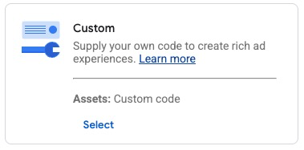

# Advanced Tracking

The advanced tracking of SmartPulse allows you to analyze in greater detail how internet users are utilizing the format.

## Main KPI

<figure><figcaption></figcaption></figure>

Before delving into the specific indicators of SmartPulse, it's necessary to discuss the impression and viewable impression indicators. The impression indicator corresponds to all the calls made to display the campaign, which also includes all the impressions purchased across the programmatic network to disseminate the said campaign. Viewable impressions, on the other hand, correspond to the number of times the Hero has been displayed, meaning it's not just the display of the pulse that leads to the counting of a viewable impression.

Similarly, the clicks and the click-through rate represent the volume of traffic sent to the advertiser, meaning the number of times the main advertisement, the Hero, has been clicked.

## Advanced KPI

### Pulse

<figure><figcaption></figcaption></figure>

The first area of advanced tracking allows you to understand the behavior of the pulse, this small advertising area that appears as soon as the advertisement is opened. Here, you'll find both the impressions and the viewable impressions of the pulse. To count a viewable impression, the pulse must be displayed on the user's screen for at least one second. You will also find information on exposure time and exposure time per user, which is the duration during which the pulse was displayed on the screen.

### Hero

<figure><figcaption></figcaption></figure>

The second area will provide you with all the information about the display of the advertisement itself, referred to as the hero. Here, you will find the number of advertisement calls, as well as the number of its viewable impressions, the click-through rates in relation to the impression and viewable impressions, and the exposure times of the main advertisement. The click-through rates, of course, concern the volume of traffic directed from the advertisements to the advertiser's website.

<figure><figcaption></figcaption></figure>

The section on opening modes allows you to understand how the user caused the advertisement to appear: by clicking on the pulse, by scrolling down the page, by scrolling up towards the page, or after a set amount of time defined during the campaign's creation. This section is very important for comprehensively understanding the type of reaction the user has to your campaign.

<figure><figcaption></figcaption></figure>

Finally, the section on video completion informs you about the level of engagement and progress of users if your campaign includes a video. This part is crucial for understanding how much of the video content is being watched and at what point users are most engaged or tend to drop off.

### Xtra

Finally, the Xtra mode enables you to understand user behavior regarding the use of this optional module. Indeed, it allows you to redirect users to an environment embedded within the website (in the form of an iframe), thus enabling a seamless continuation of the experience without leaving the publisher's site. It's important to note that this functionality is entirely optional.
